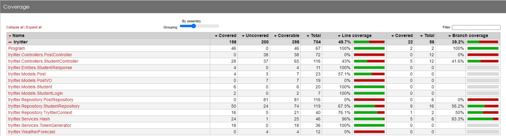

<div align="center"><h1><strong>Tryitter</strong></h1></div>

## **Contexto** 
## Projeto Final - Aceleração em .NET C#
<br />

O objetivo é proporcionar um ambiente em que as pessoas estudantes poderão, por meio de textos e imagens, compartilhar suas experiências e também acessar posts que possam contribuir para seu aprendizado.💚

Tryitter é uma rede social, totalmente baseada em texto.


<details>
  <summary><strong>As seguintes regras de negócio foram utilizadas para a construção dessa aplicação</strong></summary>
  <br />

  * As pessoas estudantes devem conseguir se cadastrar com nome, e-mail, status personalizado e senha para se autenticar.
  
  * Deve ser possível também alterar essa conta a qualquer momento, desde que a pessoa usuária esteja autenticada.

  * Uma pessoa estudante deve poder também publicar posts em seu perfil, que poderão conter texto com até 300 caracteres e arquivos de imagem
  
  * Além de conseguir pesquisar outras contas por nome e optar por listar todos seus posts ou apenas o último.

</details>
<br />

## 📑 **Tecnologias utilizadas**
<br />

  * <a href="https://dotnet.microsoft.com/pt-br/apps/aspnet" target="_blank" rel="external"><span><strong>ASP.NET</strong></span></a> - Utilizada na construção da API.

  * <a href="https://jwt.io/" target="_blank" rel="external"><span><strong>JWT</strong></span></a> - Ferramenta de autenticação de dados.

  * <a href="https://www.microsoft.com/pt-br/sql-server/sql-server-downloads" target="_blank" rel="external"><span><strong>SQL Server</strong></span></a> - Banco de Dados.

  * <a href="https://fluentassertions.com/" target="_blank" rel="external"><span><strong>FluentAssertions</strong></span></a> - Ferramenta de construção de testes.

  * <a href="https://xunit.net/" target="_blank" rel="external"><span><strong>XUnit</strong></span></a> - Ferramenta de construção de testes.

  * <a href="https://azure.microsoft.com/pt-br/" target="_blank" rel="external"><span><strong>Azure</strong></span></a> - Ferramenta de deploy.

  * <a href="https://www.nuget.org/packages/StyleCop.Analyzers/" target="_blank" rel="external"><span><strong>StyleCop analyzers</strong></span></a> - Mantém um padrão de código na aplicação (Lint).

<br />

## ⚙️ **Como iniciar o projeto localmente**
<br />

Vamos começar clonado o repositório, para isso utilize o comando a seguir:

```sh
git clone git@github.com:TamirisShigaki/Tryitter.git
```
<br />
Após ter clonado o repositório entre na pasta raiz do projeto `src/tryitter` :

```sh
cd src/tryitter
```
<br />
Em seguida execute o seguinte comando para fazer a instalação de todas as dependências:

```sh
dotnet restore

dotnet run
```
<br /> 

## 🧪 **Execução dos Testes**
<br /> 

<details>
<summary><strong>Todos os Testes</strong></summary><br/>

Entre na pasta de teste do projeto `src/tryitter.test` e em seguida execute o seguinte comando para fazer a instalação de todas as dependências:

```sh
dotnet restore
```
E execute o seguinte comando: (Isso irá executar os testes de uma única vez.)

```sh
dotnet test
```
</details>
<br />

<details>
<summary><strong>Testes de Cobertura</strong></summary>
<br/>

Na pasta dos testes ```cd src/triytter.Test``` rode o comando abaixo para instalar o reportgenerator-globaltool:

```
dotnet tool install --global dotnet-reportgenerator-globaltool --version 4.8.6
```

Depois de instalar o reportgenerator-globaltool , rode o seguinte comando para executar os testes:
```
dotnet test --collect:"XPlat Code Coverage" --settings coverlet.runsettings 
```
Depois de executar os testes, você terá um arquivo de cobertura gerado(geralmente no formato XML). O próximo passo é gerar o relatório de cobertura a partir desses arquivos.

Navegue até o diretório onde os arquivos de cobertura XML estão localizados.

Execute o seguinte comando para gerar o relatório de cobertura usando o ReportGenerator Global Tool (O relatório será gerado no formato HTML.):

```
reportgenerator "-reports:coverage.cobertura.xml" "-targetdir:coveragereport" -reporttypes:Html
```
Após a conclusão do comando acima, você encontrará um diretório chamado "coverage-report" no diretório atual.
Navegue até o diretório "coverage-report" e abra o arquivo ```index.html``` no navegador para visualizar os resultados.

</details>
<br />

### **Cobertura dos testes**

O testes deste projeto contemplaram uma cobertura de 49.7% da linhas.
<br />



<br />

## 📝 **Documentação da API**
<br />

Para saber mais, acesse a documentação:
<a href="http://localhost:5143/Swagger/index.html" target="_blank" rel="external"><span><strong>Documentação Swagger</strong></span></a>
<br />

<details>
<summary><strong>Students</strong></summary><br/>

```
  GET /Students 
```
 ```
  GET /Student/:id
```
```
  GET /Student/Name/
```
```
  POST /Student
```
```
  POST /Login 
```
```
  PATCH /Student/:id
```
```
  DELETE/Student/:id
```
</details>
<br /> 

<details>
<summary><strong>Posts</strong></summary>
<br/>

```
  GET /Post
```
```
  GET /Post/:id
```
```
  GET /Post/Student/:id
```
```
  GET /Post/Last/Student/:id
```
```
  GET /Post/StudentName
```
```
  /Post/Last/StudentName
```
```
  POST /Post
```
```
  PUT /Post/:id 
```
```
  DELETE /Post/:id 
```
</details>
<br/>

## 🏗️ **Deploy**
<br/>

O deploy da aplicação foi executado utilizando o Microsoft Azure:
<a href="https://project-tryitter.azurewebsites.net/ " target="_blank" rel="external"><span><strong>Link do deploy</strong></span></a>
<br />
<br />

## 🧑‍💻 Projeto Desenvolvido por:
<br/>

|
:-:|:-:
[Tamiris Shigaki](https://www.linkedin.com/in/tamirisshigaki/)|[João Claudio](https://github.com/joaocla)
